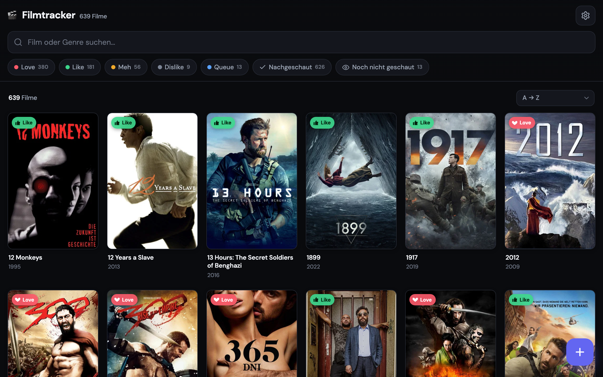

# 🎬 Filmtracker

**Persönliche Film-Datenbank als Web-App — 639 Filme bewerten, filtern, durchsuchen. Kein Login, sofort nutzbar.**
_Personal movie database as a web app — rate, filter and search 639 films. No login, instant to use._



**Live:** https://filmtrackerbambo.questside.workers.dev

---

## 🇩🇪 Deutsch

### Was ist das?
Eine schnelle Web-App, um meine Filmsammlung zu verwalten — statt einer unübersichtlichen Excel-Liste. Jeder Film bekommt eine Bewertung (Love / Like / Meh / Dislike / Queue) und einen Status (nachgeschaut / noch nicht). Filtern, sortieren und Volltextsuche über 639 Filme laufen sofort.

### Warum habe ich das gebaut?
Ich hatte meine Filme jahrelang in einer Excel-Tabelle — mühsam zu pflegen, hässlich auf dem Handy, keine Poster. Ich wollte etwas, das sich wie eine echte App anfühlt, auf jedem Gerät läuft und ohne Anmeldung sofort da ist. Beim Import werden Filme automatisch über die **TMDb-API** mit Poster, Genre, Jahr und Beschreibung angereichert.

### Wie funktioniert es?
- **Frontend:** Single-File-Web-App (Vanilla JS) — kein Framework, lädt sofort.
- **Backend:** Cloudflare Worker — eine schlanke JSON-API.
- **Speicher:** Cloudflare KV (der komplette Bestand liegt als ein JSON-Blob).
- **Anreicherung:** Beim Import matcht ein mehrstufiger Titel-Abgleich gegen die TMDb-API (behandelt Remakes, deutsche Lokalisierung, mehrdeutige Titel).
- **Kein Auth:** bewusste Entscheidung — Single-User-Tool, der TMDb-Key läuft nur server-seitig und wird nie an den Browser gesendet.

## 🇬🇧 English

### What is it?
A fast web app to manage my movie collection — replacing a messy spreadsheet. Every film gets a rating (Love / Like / Meh / Dislike / Queue) and a status (watched / not yet). Filtering, sorting and full-text search across 639 films are instant.

### Why I built it
My movies lived in a spreadsheet for years — tedious to maintain, ugly on mobile, no posters. I wanted something that feels like a real app, works on any device and needs no login. On import, films are automatically enriched with poster, genre, year and description via the **TMDb API**.

### How it works
- **Frontend:** single-file web app (vanilla JS), no framework, instant load.
- **Backend:** a Cloudflare Worker exposing a small JSON API.
- **Storage:** Cloudflare KV (the whole collection is one JSON blob).
- **Enrichment:** a multi-stage title-matching routine queries the TMDb API on import (handles remakes, German localisation, ambiguous titles).
- **No auth:** deliberate — it is a single-user tool; the TMDb key runs server-side only and is never sent to the browser.

---

## Tech
`Cloudflare Workers` · `Cloudflare KV` · `Vanilla JS` · `TMDb API`

## Lokale Entwicklung / Local dev
```bash
# TMDb-Key hinterlegen (siehe .dev.vars.example) / provide a TMDb key
cp .dev.vars.example .dev.vars   # dann TMDB_KEY eintragen / then fill in TMDB_KEY
npx wrangler dev                 # lokal starten / run locally
npx wrangler deploy              # deployen (eigener Cloudflare-Account) / deploy
```
Der TMDb-Key wird als Cloudflare-Secret gesetzt: `npx wrangler secret put TMDB_KEY`.
